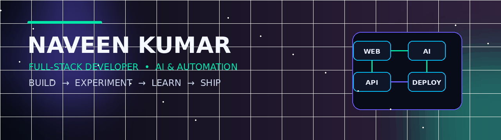

<!-- ========================= -->
<!--        HERO HEADER        -->
<!-- ========================= -->

<p align="center">
  
</p>

<!-- ========================= -->
<!--       TYPING EFFECT       -->
<!-- ========================= -->

<p align="center">
  
</p>

<p align="center">
  <a href="https://naveen-modern-portfolio.vercel.app">
    
  </a>
  <a href="https://www.linkedin.com/in/naveen-kumar-4aa6b635b/">
    
  </a>
  <a href="https://github.com/Naveenkumar-Siva10">
    
  </a>
</p>

---

# 👨‍💻 ABOUT ME

<table>
<tr>
<td width="55%">

### Hey, I'm Naveen 👋

I'm a **Full-Stack Developer** interested in building modern digital products, AI-powered experiences and automation systems.

I enjoy working across the complete product journey:

```text
IDEA
 ↓
DESIGN
 ↓
DEVELOPMENT
 ↓
DATABASE
 ↓
API
 ↓
DEPLOYMENT
 ↓
OPTIMIZATION
